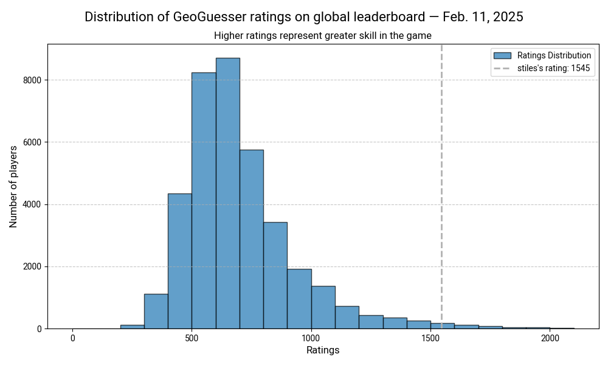
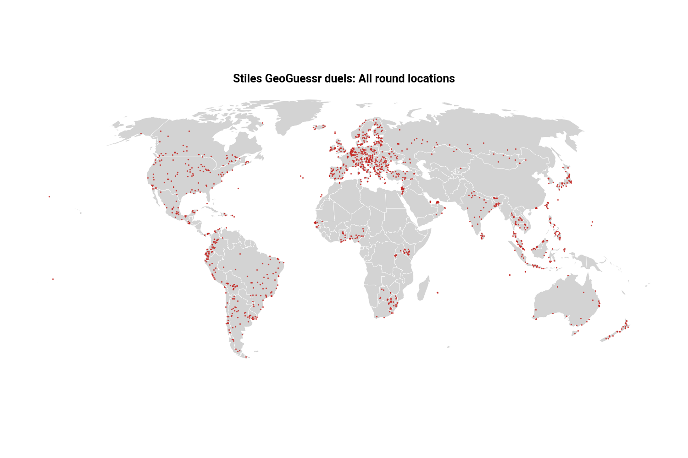
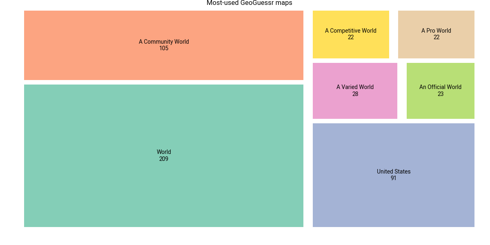

# GeoGuessr tools

This repository contains scripts to help you fetch and analyze data about your GeoGuessr games, including duel results, historical summaries, leaderboards and round metadata.

## Prerequisites

1. **Python 3.x** installed.
2. Required packages: `requests`, `beautifulsoup4`, `pandas`, `tqdm`, `rich`.
   - Install them using `pip install -r requirements.txt`.
3. **`config.py` File**:
   - You must create a `config.py` file in the `scripts/` directory with your **session cookies** and **headers** to access GeoGuessr API endpoints.

   Example `config.py`:
   ```python
   headers = {
       "User-Agent": "Mozilla/5.0 (Macintosh; Intel Mac OS X 10_15_7)",
       "Accept-Language": "en-US,en;q=0.9",
       "Referer": "https://www.geoguessr.com/"
   }

   cookies = {
       "session": "<YOUR_SESSION_COOKIE>"
   }
   ```

   Replace `<YOUR_SESSION_COOKIE>` with your valid GeoGuessr session cookie.

---

## Scripts

### 1. Fetch single duel details
**Script**: `fetch_single_duel_summary.py`
- **Description**: Fetch details about a single GeoGuessr duel, including your guesses, round locations and game outcome.
- **Usage**:
   - Replace the `duel_id` variable with the ID from the duel URL.
   - Run the script:
     ```bash
     python scripts/fetch_single_duel_summary.py
     ```
- **Output**:
   - Stores an array of objects, where each object contains details for a single round in the duel:
     - Actual and guessed coordinates for each round
     - User's guess distance from actual for each round
     - User's win/loss outcome

**Example JSON array containing objects:** 
```json
    [
      {
         "duel_id": "89c51cdf-4484-4ea5-9bce-07e90003034a",
         "created": "2024-11-21T05:12:51.106000Z",
         "duel_outcome": "Win",
         "duel_opponent": "TaylorB",
         "duel_round_num": 1,
         "actual_lat": 35.70042632,
         "actual_lng": 139.8095272,
         "my_guess_lat": 35.238317611213844,
         "my_guess_lng": 136.8968754648163,
         "my_guess_distance": 268717.02495217,
         "my_guess_miles": 167.0087,
         "my_health_after": 4086
      },
      {
         "duel_id": "89c51cdf-4484-4ea5-9bce-07e90003034a",
         "created": "2024-11-21T05:12:51.106000Z",
         "duel_outcome": "Win",
         "duel_opponent": "TaylorB",
         "duel_round_num": 2,
         "actual_lat": 40.69625895,
         "actual_lng": -73.98882077,
         "my_guess_lat": 40.69538073463815,
         "my_guess_lng": -73.98945849588905,
         "my_guess_distance": 111.4751351009,
         "my_guess_miles": 0.0693,
         "my_health_after": 5000
      }
   ]
```

---

### 2. Fetch your duel history
**Script**: `fetch_historical_duel_summaries.py`
- **Description**: Fetch all your historical duels by:
   1. Scanning your browser history for duel URLs.
   2. Downloading the duel details for each duel found.
- **Requirements**:
   - Works on **Chrome** history (macOS assumed). Modify paths for other operating systems if needed.
- **Usage**:
   ```bash
   python scripts/fetch_historical_duel_summaries.py
   ```
- **Output**:
   - JSON files for each duel are saved in `data/duels/individual`.
   - A consolidated JSON file (`duel_results.json`) with a list of dictionaries that contain round details, guesses, outcomes and opponents.

**Example JSON output**: 
```json
   [
      {
         "duel_id":"defa3155-0ff9-42e7-947a-8fab519496a4",
         "created":"2024-12-10T03:53:49.873000Z",
         "duel_outcome":"Win",
         "duel_opponent":"Orcaaa",
         "duel_round_num":2,
         "actual_lat":33.0613925452,
         "actual_lng":35.6050357439,
         "my_guess_lat":31.6596474385,
         "my_guess_lng":35.1936042435,
         "my_guess_distance":160585.5110546418,
         "my_guess_miles":99.8045,
         "my_health_after":4585
      }
   ]
```
*Other rounds from historical duels omitted for brevity.*

---

### 3. Fetch the global leaderboard
- **Script**: `fetch_leaderboard.py`
- **Description**: Fetch the GeoGuessr global leaderboard data.
- **Usage**:
   ```bash
   python scripts/fetch_leaderboard.py
   ```
- **Output**:
   - Saves leaderboard data as an array of records with unique fetch dates, making it suitable for time series analysis at `data/leaderboard/geoguessr_leaders_timeseries.json`.

**Example JSON output**: 

```json
[
    {
        "position":1,
        "rating":2251,
        "userId":"5ffb5e4975d2770001545cf5",
        "nick":"apablasbe",
        "isVerified":false,
        "isDeleted":false,
        "flair":1,
        "countryCode":"gb",
        "date":"2024-12-13"
    },
    {
        "position":2,
        "rating":2242,
        "userId":"57d301d409f2efcce834fc94",
        "nick":"Radu C",
        "isVerified":true,
        "isDeleted":false,
        "flair":6,
        "countryCode":"us",
        "date":"2024-12-13"
    },
    {
        "position":3,
        "rating":2204,
        "userId":"5bf491faaac55b998458ed9a",
        "nick":"mk",
        "isVerified":true,
        "isDeleted":false,
        "flair":7,
        "countryCode":"us",
        "date":"2024-12-13"
    }
]
```
**Rankings histogram**: Another script — `visualize_leaderboard.py` - creates a histogram showing the distrubution of player ratings on the global leaderboard and where a defined user ranks in those bins. 



---

### 4. Fetch round metadata
**Script**: `fetch_round_metadata.py`
- **Description**: Fetch additional metadata (e.g., place names and addresses) for a specific round's coordinates using the Google Maps API endpoint.
- **Requirements**:
   - Set your Google Maps API key in your environment:
     ```bash
     export GOOGLE_MAPS_API_KEY="YOUR_API_KEY"
     ```
- **Warning**: Do not use this during competitive play. You can and should be banned for doing so.
- **Usage**:
   - Replace the `location_id` variable with the appropriate ID.
   - Run the script:
     ```bash
     python scripts/fetch_round_metadata.py
     ```
- **Output**:
   - Prints the round location name and coordinates.

**Example**: 
```bash
Location: Zagreb, City of Zagreb
Coordinates: (45.80859592623649, 16.004239630666675)
```

---

### 5. Analyze duel history
**Script**: `analyze_duel_history.py`
- **Description**: Reads the historical duels JSON file and plots the round locations. It also performs a spatial analysis on the coordinates for each round and counts the frequency by country. 
- **Usage**:
   - Run the script:
     ```bash
     python scripts/analyze_duel_history.py
     ```
- **Outputs**:
   - Map: `visuals/maps/duel_locations_world_map.png`
   - Countries JSON: `data/duels/analysis/duel_counts_countries.json`  

**Examples**:




```json
[
    {
        "name":"United States of America",
        "duel_count":40
    },
    {
        "name":"Brazil",
        "duel_count":29
    },
    {
        "name":"Malaysia",
        "duel_count":23
    }
]
```
*Example truncated for brevity*

### 6. Fetch activity history
- `fetch_activity_history.py`: Fetch your entire GeoGuessr activity feed, including information about completed duels, challenges and other game modes. Then make some basic charts. Data exported to `data/activity/geoguessr_activity.json`. Charts exported to `visuals/charts/`. 

**Activity data sample:**: 

```json
   [
      {
         "type":7,
         "time":1734655689851,
         "user":"stiles",
         "payload_type":1.0,
         "payload_time":"2024-12-20T00:43:30.647+00:00",
         "game_mode":"Standard",
         "competitive_mode":null,
         "game_id":null,
         "map_slug":"world",
         "map_name":"World",
         "points":19949.0,
         "date":"2024-12-20"
    },
   {
         "type":7,
         "time":1734713196260,
         "user":"stiles",
         "payload_type":6.0,
         "payload_time":"2024-12-20T16:46:36.26+00:00",
         "game_mode":"Duels",
         "competitive_mode":"NoMoveDuels",
         "game_id":"aba97a92-8599-4252-ad1a-8187e953a668",
         "map_slug":null,
         "map_name":null,
         "points":null,
         "date":"2024-12-20"
      }
   ]
```
*Example truncated for brevity*

**Activity chart**: 



### 7. Other miscellaneous scripts
- `fetch_world_cities.py`: Fetches an [Esri feature service](https://services.arcgis.com/P3ePLMYs2RVChkJx/arcgis/rest/services/World_Cities/FeatureServer/0) of large world cities, filtering it to national capitals and exporting `data/geo/reference/national_capitals.json`. 
- `check_google_coverage.py`: Loops through the capitals dataframe and queries the Google Street View API to determine whether there's official coverage. Returns `data/geo/reference/official_street_view_coverage.json`

---

## File Structure

```
guessr-fetch/
├── visuals/
│   └── maps/
│       └── duel_rounds_map.png
│
├── scripts/
│   └── analyze_duel_history.py
│   ├── fetch_single_duel_summary.py
│   ├── fetch_historical_duel_summaries.py
│   ├── fetch_leaderboard.py
│   └── fetch_round_metadata.py
│
├── data/
│   └── duels/
│       ├── all/                   # User's complete duel history as structured JSON
│           ├── individual_dump    # Each duel's raw JSON response from GeoGuessr
│       └── individual/            # Individual duels as structured JSON
│   └── leaderboard/               # JSON with unique fetch dates showing the leaderboard over time
│   └── geo/
│       ├── reference/             # Files for spatial analysis, e.g. countries.geojson
│
└── config.py             # Your headers and cookies
```

---

## Notes
- Use responsibly. These scripts require access to your authenticated session. 
- Keep your `config.py` file private to avoid leaking sensitive information.

---

## License
This project is for personal use and learning purposes only.
